# 🧠 SmritiCare (স্মৃতি কেয়াৰ / स्मृति केयर)
### *AI-Powered Cognitive Care, Medication Safety & Frontline Geriatric Support Platform*
> **Smart India Hackathon (SIH 2026)** | Project ID: **SIH-2026-SMRITI**  
> **Developed by**: **Team StarX** (Leader: **Vikas Kumar** | **Priyanshu Jain**, **Aditya Raghav**, **Ananya Jain**, **Arpit Singh**, **Prabal Chauhan**) | **Geographic Focus**: Titabor, Jorhat District, Assam, India

[](https://react.dev/)
[](https://www.typescriptlang.org/)
[](https://tailwindcss.com/)
[](https://vitejs.dev/)
[](LICENSE)

---

## 🌟 Executive Summary

**SmritiCare** is a clinical-grade, offline-first, multilingual digital cognitive companion designed to assist elders experiencing mild cognitive impairment (MCI) or early-stage Alzheimer’s, their family caregivers, primary healthcare physicians, and frontline **ASHA (Accredited Social Health Activists)** workers.

The platform combines **neuro-cognitive stimulation games with dynamic 3-tier adaptive difficulty**, **AI Vision medicine package scanner**, **AI lab report biomarker translator**, **voice reminiscence photo album**, and **Smriti Sathi** conversational assistant localized in **Assamese (অসমীয়া)**, **Hindi (हिन्दी)**, and **English**.

---

## 📸 Visual Tour & UI Showcase

### 1. 🌌 Futuristic 3D Landing Showcase & Hero Experience
*Immersive dark frosted glassmorphism interface with neon purple & cyan lighting, animated 3D SmritiCare emblem, and cross-district clinical reach metrics.*

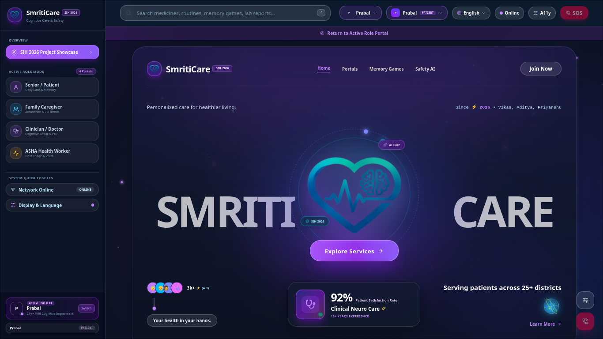

---

### 2. 👵 Senior / Patient Care Dashboard & Multi-Patient Switcher
*Personalized elder dashboard featuring real-time vitals, daily pill progress, hydration logs, and dynamic patient profile switcher.*

| Senior Home Dashboard | Dynamic Patient Profile Manager |
| :---: | :---: |
| 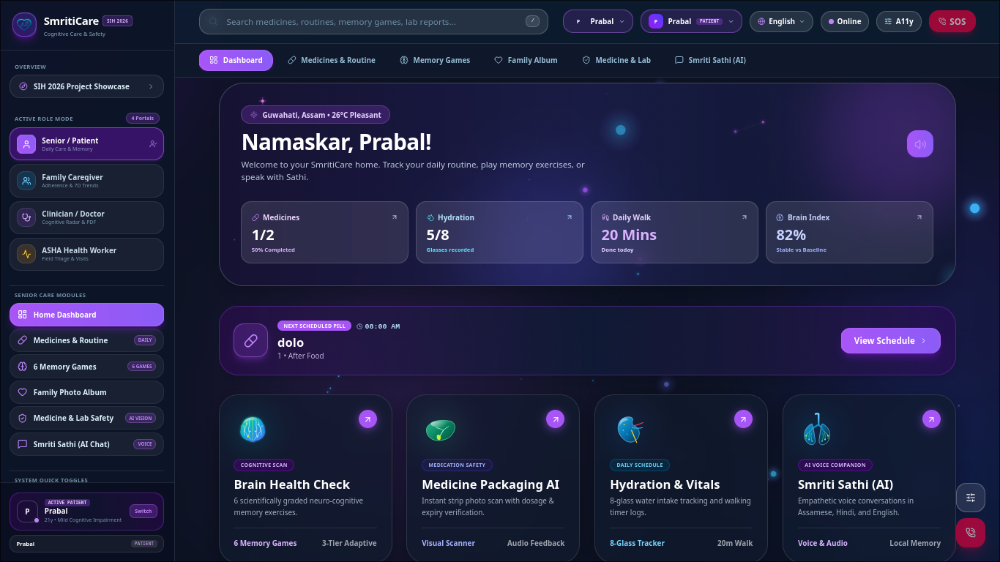 | 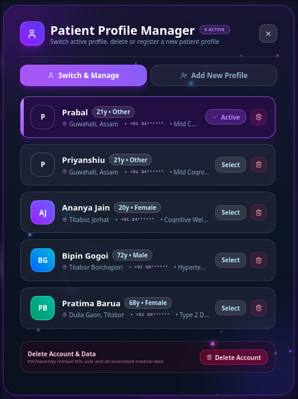 |

---

### 3. 💊 Daily Routine & Smart Pill Adherence Tracker
*High-contrast schedules for morning/evening medicines, 8-glass hydration counter, courtyard walking timers, and audio prompts.*

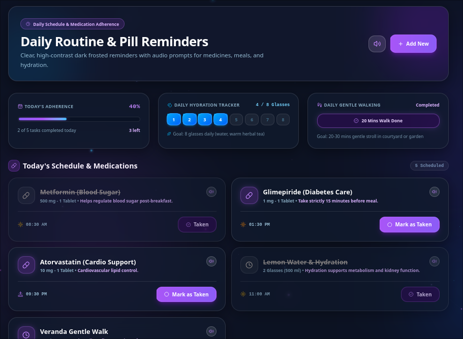

---

### 4. 🎮 6 Culturally Grounded Cognitive Care Games (3-Tier Adaptive AI)
*Neuro-cognitive stimulation modules rooted in Assamese heritage (Japi & Gamusa matching, tea-leaf sequencing, Brahmaputra trail making, and village recall) with auto-adjusting difficulty tiers.*

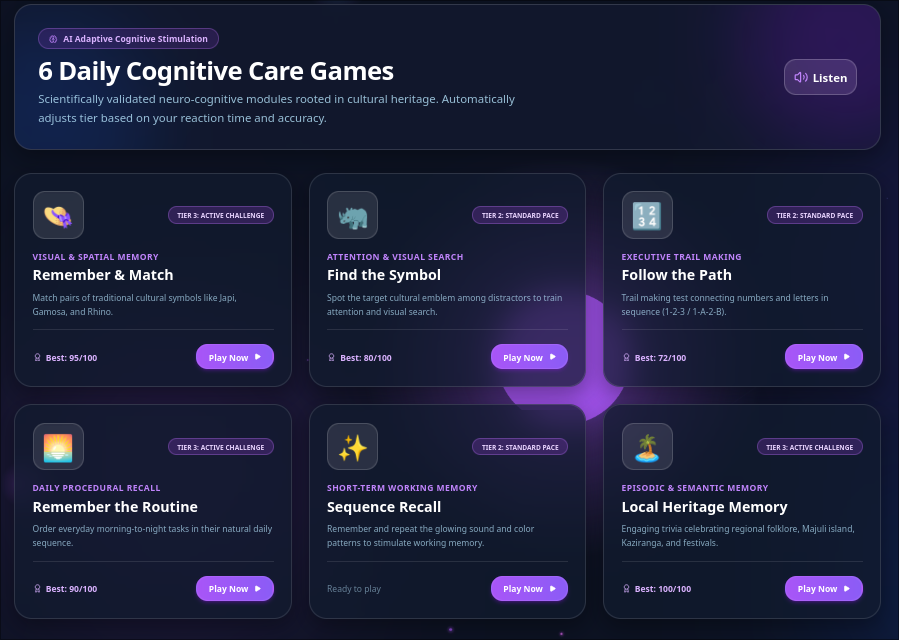

---

### 5. 🔬 AI Medicine Packaging Safety Scanner
*Multimodal computer vision scanner to verify blister packs, tablet strength, dosage frequency, and prescription safety warnings.*

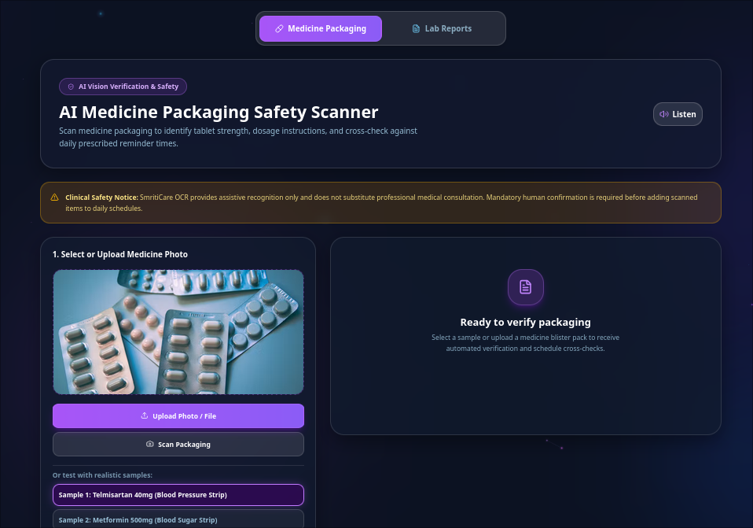

---

### 6. 🎙️ Smriti Sathi — Multilingual AI Care Companion
*Empathetic trilingual voice assistant with local memory, providing warm geriatric support, routine reminders, and cultural conversations.*

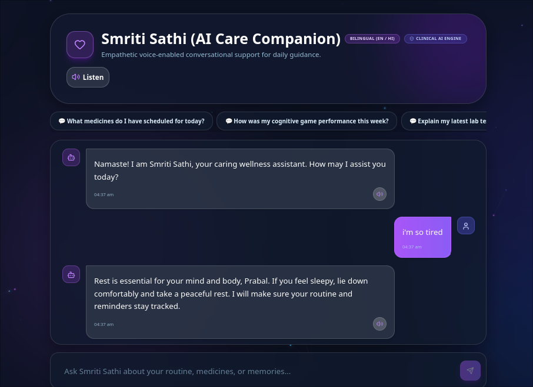

---

### 7. 👩‍⚕️ Frontline ASHA Health Worker Portal
*Titabor block rural elder registry, doorstep visit logger, medicine stock countdown, and clinical triage tracking.*

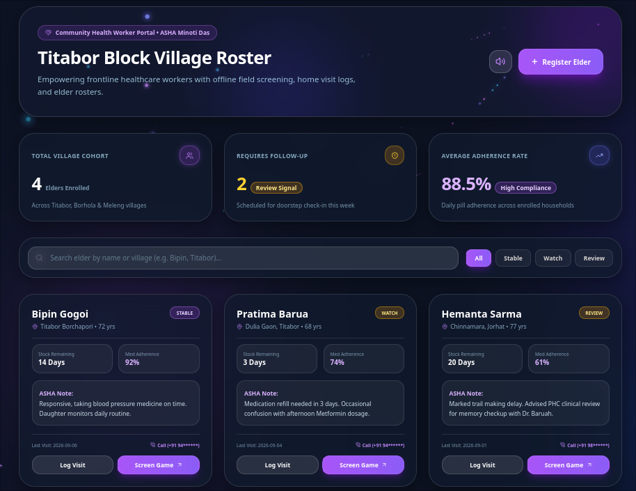

---

### 8. ⚙️ Geriatric Accessibility & Live AI Settings (A11y)
*Comprehensive accessibility suite: Assamese / Hindi / English language toggles, 3-tier font scaling, WCAG AAA high-contrast mode, and live vision API key verification.*

<div align="center">
  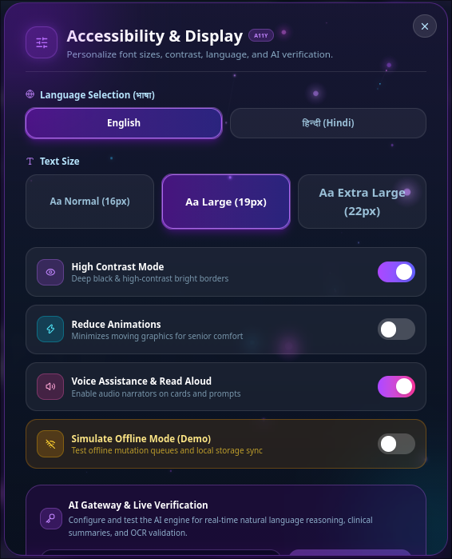
</div>

---

### 9. 👨‍👩‍👧 Family Caregiver Portal & Longitudinal Analytics
*Real-time medication compliance tracking, 7-day multi-domain cognitive performance curves, assigned ASHA contact, and family observation notes.*

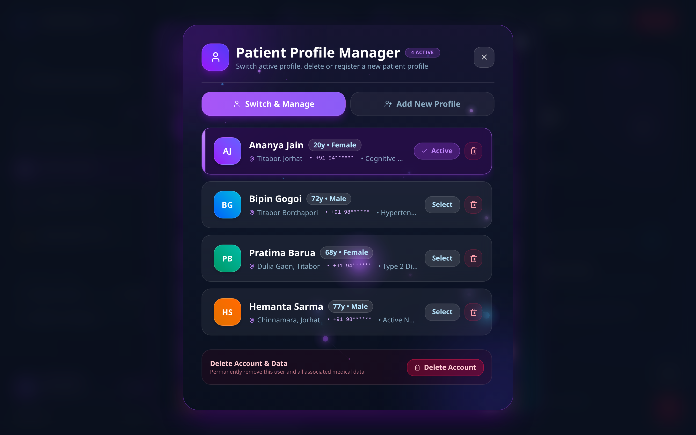

---

### 10. 🩺 Clinician Assessment & Multi-Domain Radar Portal
*Multi-axial cognitive radar chart comparing current performance against personal baselines, domain stability diagnostics, and 1-click clinical PDF export.*

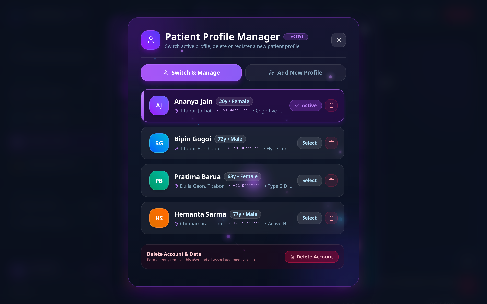

---

### 11. 🚨 One-Touch Emergency SOS & Offline Geo-Location
*High-visibility emergency modal broadcasting live GPS coordinates, local police/ambulance speed dials, and primary family contact dispatch.*

<div align="center">
  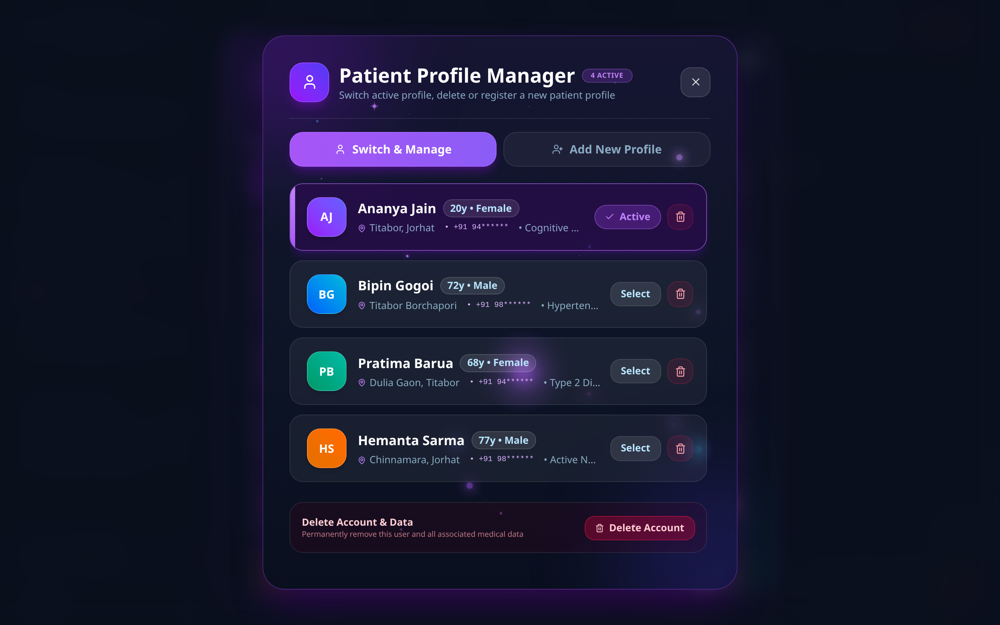
</div>

---

## 👥 4 Tailored Stakeholder Portals

| Portal | Primary User | Key Capabilities |
| :--- | :--- | :--- |
| **👴 Senior / Patient** | Rural & semi-urban elders | High-contrast UI, daily routine audio narrator, 6 culturally localized memory games, voice reminiscing album, and AI chat companion. |
| **👨‍👩‍👧 Family Caregiver** | Primary family members | Real-time medication adherence tracking, 7-day longitudinal cognitive trends, hydration logs, and ASHA visit notes. |
| **🩺 Clinician / Doctor** | PHC Doctors & Neurologists | Multi-domain cognitive radar (visual memory, executive function, attention), baseline drift diagnostics, and 1-click clinical PDF download. |
| **👩‍⚕️ ASHA Health Worker** | Frontline community workers | Village geriatric roster (Titabor cohort), offline field screening tests, doorstep home visit logger, and medicine stock tracking. |

---

## 🎮 6 Neuro-Cognitive Games (with Adaptive 3-Tier AI Engine)

1. **Japi & Gamusa Cultural Pair Matching** (`RememberMatchGame.tsx`) — Visual & working memory.
2. **Sequential Tea Leaf Tap** (`SequenceRecallGame.tsx`) — Working memory & sequence recall.
3. **Assamese Symbol Odd-One-Out** (`FindTheSymbolGame.tsx`) — Selective attention & visual discrimination.
4. **Brahmaputra Boat Route Trail Making** (`FollowPathGame.tsx`) — Visuospatial coordination & processing speed.
5. **Morning Routine Chronological Order** (`RememberRoutineGame.tsx`) — Executive function & temporal sequencing.
6. **Local Landmark & Village Recall** (`LocalMemoryGame.tsx`) — Semantic association & long-term recall.

### 📈 Adaptive Difficulty Algorithm (`src/lib/adaptiveDifficulty.ts`)
Calculates real-time performance adjustments:
$$\text{Performance Score} = (\text{Accuracy} \times 0.65) + (\text{Speed Factor} \times 0.35)$$
- **Tier 1 (Gentle)**: 4 cards / 2 sequences (Reduced cognitive load)
- **Tier 2 (Standard)**: 6 cards / 3 sequences (Standard clinical baseline)
- **Tier 3 (Challenging)**: 8 cards / 4 sequences (Advanced cognitive stimulation)

---

## 🔬 AI Safety & Multimodal Diagnostics

- **AI Medicine Packaging Scanner (`MedicineSafetyScanner.tsx`)**: Analyzes blister packs and medicine strips using vision models, extracts generic/brand names, verifies dosage against prescription schedules, and alerts for missing doses.
- **AI Lab Report Analyzer (`LabReportAnalyzer.tsx`)**: Translates complex blood, liver, lipid, and hemoglobin test parameters into friendly plain language with dietary advice in Assamese and Hindi.
- **Voice Reminiscence Engine (`MemoryJournal.tsx`)**: Plays familiar voice audio narrations with family milestones to trigger positive autobiographical memories.
- **Smriti Sathi Voice Companion (`AIChatCompanion.tsx`)**: Empathetic conversational companion with multi-dialect Assamese, Hindi, and Indian English speech synthesis.

---

## 🌐 Localization & Accessibility (A11y)

- **Trilingual Localization (`src/lib/i18n.ts`)**: Complete interface translation in **English**, **हिन्दी (Hindi)**, and **অসমীয়া (Assamese)**.
- **Universal Voice Narrator (`VoiceNarratorButton.tsx`)**: Web Speech API integration with auto-detected phonetic voices.
- **Geriatric Accessibility**: 3-tier font scaling (Normal / Large / Extra Large), High Contrast mode (WCAG AAA compliant), and Reduced Motion settings.
- **Privacy First**: Built-in phone number masking (`+91 94******`) across all emergency modals, ASHA rosters, and caregiver cards.
- **Offline-First Resilience (`OfflineBanner.tsx`)**: LocalStorage persistence with simulated offline sync mode.

---

## 🛠️ Tech Stack & Architecture

```
Smriti_care/
├── docs/
│   └── screenshots/        # High-resolution UI showcase images
├── src/
│   ├── components/
│   │   ├── chat/           # Smriti Sathi conversational AI companion
│   │   ├── common/         # TopHeader, Sidebar, ProfileManager, A11yModal, EmergencyModal
│   │   ├── dashboards/     # Patient, Caregiver, Clinician, ASHA dashboards
│   │   ├── games/          # 6 Neuro-cognitive games + GameShell + Adaptive tier
│   │   ├── journal/        # Voice reminiscence memory journal
│   │   ├── landing/        # Futuristic 3D anatomical hero showcase & 3D logo visual
│   │   ├── routine/        # Pill schedule, hydration tracker, walking timer
│   │   ├── safety/         # AI Medicine Packaging & Lab Report Analyzer
│   │   └── visuals/        # 3D Crystal Organ Visuals (Brain, Lungs, Liver, Kidney)
│   ├── context/            # Global AppContext (state, role, settings, profile manager)
│   ├── lib/                # i18n, adaptiveDifficulty, aiClient, pdfReport, speech, storage, utils
│   ├── types/              # TypeScript schemas & interfaces
│   ├── App.tsx             # Root layout shell with dynamic glow orbs
│   └── index.css           # Glassmorphism utilities & cybernetic lighting
```

---

## 🚀 Getting Started

### Prerequisites
- Node.js (v18 or higher)
- npm (v9 or higher)

### Installation & Launch

```bash
# 1. Clone the repository
git clone https://github.com/Jin-woo-tech/Smriti_Care.git
cd Smriti_Care

# 2. Install dependencies
npm install

# 3. Start local development server
npm run dev
```

Open **`http://localhost:5173`** in your browser.

### Production Build & Verification

```bash
npm run build
npm run preview
```

---

## ⚠️ Clinical Safety Notice

> **Medical Disclaimer**: SmritiCare is a supportive cognitive stimulation, medication reminder, and caregiver coordination tool. It does not provide definitive medical diagnoses of Alzheimer's Disease or dementia. For acute emergencies, please contact emergency medical services (**108** in Assam) or visit your nearest primary healthcare centre.

---

## 🏆 Project Credits

- **Team**: **Team StarX**
- **Team Leader**: **Vikas Kumar**
- **Team Members**:
  - 👑 **Vikas Kumar** (Team Leader)
  - 🌟 **Priyanshu Jain**
  - 🌟 **Aditya Raghav**
  - 🌟 **Ananya Jain**
  - 🌟 **Arpit Singh**
  - 🌟 **Prabal Chauhan**
- **Initiative**: Smart India Hackathon (SIH 2026)
- **Community & Clinical Partner**: Titabor Block Primary Healthcare Network, Jorhat District, Assam, India
